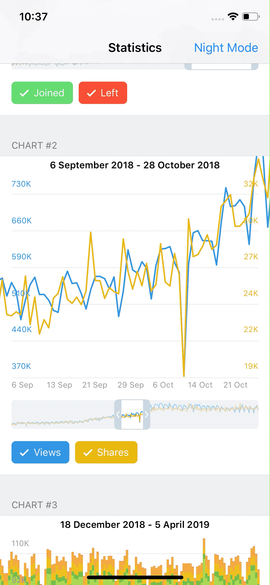
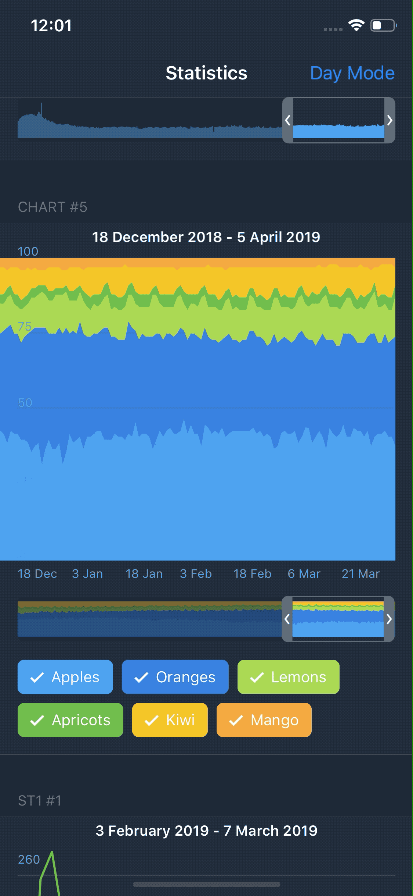

# telegram-contest-2019
Telegram (official coding competition) [https://t.me/contest/59] for iOS developers.
An app for showing simple charts based on predefined input data.

This app hasn't received any prize. There are no animations of axis and charts. Also, there are a lot of bugs, and of course, it has only 'hackathon style' code. However, I hope this code could be useful by showing an approach on how to solve such tasks.

|                   |                   |                   |
|-------------------|-------------------|-------------------|
||||

## Stage 2
[Input data format](https://t.me/contest/66)
[iOS Design spec](https://telegra.ph/iOS-Design-Specification-04-07)

## Stage 1
Telegram is holding a competition for Android/JavaScript/iOS developers. March 10-24, $125,000 in prizes. Details are available here: https://t.me/contest/6